# Sukoon AI Therapist Companion

Sukoon is a mental-wellness web application. People can talk with an AI companion, track mood in a journal, find a therapist, and manage appointments. Therapists get a practice workspace. Administrators review users, therapist applications, and support tickets.

**Live site:** [https://www.sukoon.tech](https://www.sukoon.tech)

The public HTTPS site was opened in a browser on 2 October 2026. The homepage, login, and Client, Therapist, and Admin demo flows loaded from that host. The apex name `sukoon.tech` is not a reliable entry point yet. See [Limitations](#limitations-and-future-work).

Author: **Syed Moiz** (GitHub: [SYMOIZ](https://github.com/SYMOIZ)). This is not a clinical service and does not replace a licensed therapist.

## Documentation

| Topic | Where |
|---|---|
| Setup, features, and how to run the app | This README, [Setup](#setup) |
| Architecture | [docs/architecture/README_ARCHITECTURE.md](docs/architecture/README_ARCHITECTURE.md) |
| Backend and database | [docs/architecture/README_BACKEND.md](docs/architecture/README_BACKEND.md) |
| Deployment and AWS | [docs/deployment/deployment.md](docs/deployment/deployment.md), [docs/deployment/aws-services.md](docs/deployment/aws-services.md) |
| Earlier unused AWS account | [docs/deployment/aws-deployment-inventory.md](docs/deployment/aws-deployment-inventory.md) |
| Hackathon proof and screenshots | [docs/proof/README.md](docs/proof/README.md) |
| App screenshots | [docs/screenshots/](docs/screenshots/) |

## Problem and solution

Stress, anxiety, and low mood do not keep office hours, and a first conversation with a professional can be hard to start. Sukoon gives a private web space for an immediate AI check-in, a mood journal, and a directory of practitioner profiles, with separate tools for the therapist and for an operator who reviews the network.

## Features

- Public landing page with product navigation
- Email and password login, Continue with Google, and Quick Demo Access
- Client home with chat, mood tracking, and therapist discovery
- AI therapist chat (Gemini, with an OpenAI fallback on the server when Gemini is unset)
- Therapist directory and a client bookings list
- Mood journal
- In-app notifications and account settings
- Therapist practice overview, patient registry, and weekly calendar
- Admin analytics, user management, therapist application review, and support tickets

## Client, Therapist, and Admin flows

Sign in from **Log In**. **Quick Demo Access** opens a real session for each role. No password is published here. The demo buttons call `POST /api/auth/demo-login`.

| Role | What you can open | Demo identity shown in the app |
|---|---|---|
| Client | Dashboard, AI chat, journal, therapist directory, notifications, settings | Demo Account, `demo.client@sukoon.ai` |
| Therapist | Practice overview, calendar, patient registry, settings | Dr. Sarah Connor, `counselor@sukoon.ai` |
| Admin | Analytics, user base, therapist network, support tickets | Admin session from Admin Demo |

Client Demo is a separate account type. Chat and journal for that account stay in the browser session. Booking, Help Desk, and other actions that would create a permanent record send the visitor to sign-up instead. A normal client, therapist, or admin account is not under those demo rules.

On the live site, Client Demo booking opened the sign-up screen with the message that the Client Demo account cannot be upgraded. The appointment scheduler itself was not captured. See the screenshot notes below.

## AI functionality

Chat is labeled AI Assistant. A live Client Demo session on 2 October 2026 sent “Hello” and received replies from the assistant in the chat panel. The browser calls the Node gateway, which calls Gemini (`gemini-2.5-flash` in the current client). The gateway reads `GEMINI_API_KEY` and falls back to `OPENAI_API_KEY` when Gemini is unset. The production host has the Gemini parameter configured. An OpenAI key was not set on that host during deployment.

The assistant is a wellness companion. It is not a diagnosis or a crisis service. The chat screen includes an emergency control for that reason.

## Architecture

```text
Browser
  -> HTTPS (nginx + certificate on the EC2 host)
  -> Node gateway, port 3000
       /api/engine/*  handled by Node (AI)
       other /api/*   proxied to FastAPI
  -> FastAPI, port 3001
  -> PostgreSQL 16 in Docker, bound to 127.0.0.1:5432
```

The React UI is built with Vite and served by the Node process when `NODE_ENV=production`. FastAPI owns accounts, journal, bookings, admin actions, and the PostgreSQL models. systemd unit `sukoon.service` starts the Node process and restarts it on failure. The database container uses a restart policy so it comes back after a reboot.

## Tech stack

- React 19, TypeScript, Vite 5, Tailwind-style utility classes
- Node gateway: Express 5, `tsx`, `server.ts`
- API: FastAPI, SQLAlchemy, Pydantic, psycopg2
- Database: PostgreSQL 16
- AI: Google Gemini (`@google/genai`), optional OpenAI fallback
- Google sign-in: Firebase Auth popup, then the app API
- Migrations: Alembic revision `73ebc74ae218`

The frontend `supabase` client in this repo is a local shim that posts to `/api/db` and `/api/auth`. Supabase is not the production database.

## AWS architecture

Current production account: `159412676011`, region `us-east-1`. Deployed 2 October 2026 with the AWS CLI. No RDS, NAT gateway, or load balancer.

| Resource | Identifier | Role |
|---|---|---|
| EC2 | `i-01a7d38c28e94d81d`, name `sukoon-hackathon`, `t3.micro` | App, nginx, and private Postgres |
| Elastic IP | `44.218.253.204` | Public address for `www` |
| Security group | `sg-0beb2bd2ced3d1ec4` (`sukoon-web`) | Inbound TCP 80 and 443 only |
| Volume | `vol-07350a72c6a46361c`, 20 GiB gp3 | Root disk |
| S3 | `sukoon-deploy-159412676011` | Private deploy bundle |
| SSM | `/sukoon/gemini-api-key` (SecureString) | Gemini key, not stored in git |
| IAM | role `sukoon-ec2-role`, instance profile `sukoon-ec2-profile` | SSM agent and read access to the deploy bucket and `/sukoon/*` |

nginx terminates TLS and proxies to `127.0.0.1:3000`. Certificate SANs are `sukoon.tech` and `www.sukoon.tech`. PostgreSQL is published only on the instance loopback. Port 5432 is not in the security group.

An earlier deploy on account `591292939267` was inventoried and was not deleted. It is not the live site. See [docs/deployment/aws-deployment-inventory.md](docs/deployment/aws-deployment-inventory.md).

Rough run cost if left on: about $13 per month (t3.micro, one public IPv4, 20 GiB gp3), less if the EC2 free tier still applies. This is an estimate, not a bill.

## Database

PostgreSQL 16 runs in Docker on the EC2 host, database name `sukoon`, listening on `127.0.0.1:5432`. The password and `DATABASE_URL` live in `/opt/sukoon/.env` (mode 600) on the host. They are not in git.

Alembic revision `73ebc74ae218` is the initial schema. The API creates tables on startup and seeds demo content when the journal table is empty. During the 2 October deploy, a non-demo signup and a journal row were written and read back on this host. That check is recorded in the deployment notes. A screenshot of the database was not taken.

## Authentication and security

- Email and password sessions use an HMAC bearer token stored in the browser (`sukoon_auth_token`).
- Quick Demo Access does not return passwords.
- Continue with Google uses the Firebase project `sukoon-e8df7`, then `POST /api/auth/login_google` or `signup_google`. Amazon Cognito was not added.
- Client Demo cannot delete its account. The API rejects that delete. Normal accounts keep their own persistence.
- The security group does not allow SSH or Postgres from the internet. Host access used for deployment was AWS Systems Manager.
- Secrets are environment variables and SSM. They are not printed in this document.
- Admin screens are blocked below the desktop breakpoint (“Desktop Access Only”).

Google sign-in on `www.sukoon.tech` still depends on that domain being allowed in the Firebase project. That click was not completed in this capture pass.

## Demo access

1. Open [https://www.sukoon.tech](https://www.sukoon.tech).
2. Choose **Log In**.
3. Under **Quick Demo Access**, choose **Client Demo**, **Therapist Demo**, or **Admin Demo**.

Use a wide window for Admin. The admin UI refuses a narrow viewport.

## Setup

Local development uses the same app. It does not change the live host.

1. Install Node.js, Python 3, and Docker.
2. Copy environment values into a gitignored `.env`: `DATABASE_URL` and `GEMINI_API_KEY`. Do not commit that file.
3. Start PostgreSQL with `docker-compose.yml` (local compose publishes port 5432 on the machine; production does not).
4. Apply the existing Alembic revision if the database is empty.
5. `npm install`
6. `npm run dev` starts the Node gateway and the FastAPI process.

`npm run build` produces `dist/`. `npm start` with `NODE_ENV=production` serves that build.

## Deployment

Production is already running. Do not treat this section as a request to redeploy.

The host was created with the AWS CLI: one `t3.micro`, the security group above, a private S3 bundle (`sukoon-app.tar.gz`, install script), and an SSM parameter for the Gemini key. User data installed Node, Python packages, Docker Postgres, and `sukoon.service`. HTTPS was added later with nginx and Certbot after DNS for `www` pointed at the Elastic IP. Port 80 redirect-to-app was removed so nginx could own 80 and 443.

DNS is at the domain registrar, not in Route 53. `www.sukoon.tech` is an A record to `44.218.253.204`. The apex still includes Google A records, so `https://sukoon.tech` is not reliable until those records are removed.

Step-by-step notes and the earlier account inventory are in [docs/deployment/](docs/deployment/).

## Screenshots

Captured in the browser from [https://www.sukoon.tech](https://www.sukoon.tech) on 2 October 2026. Personal emails and the admin risk-flag text were blurred. The booking scheduler was not captured.


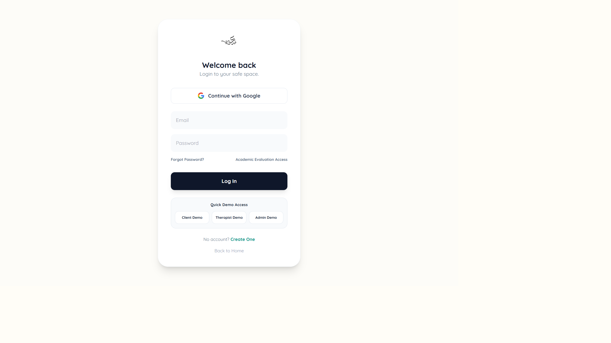

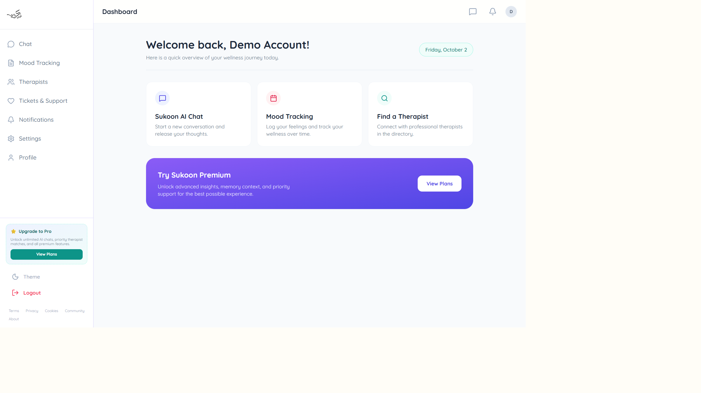

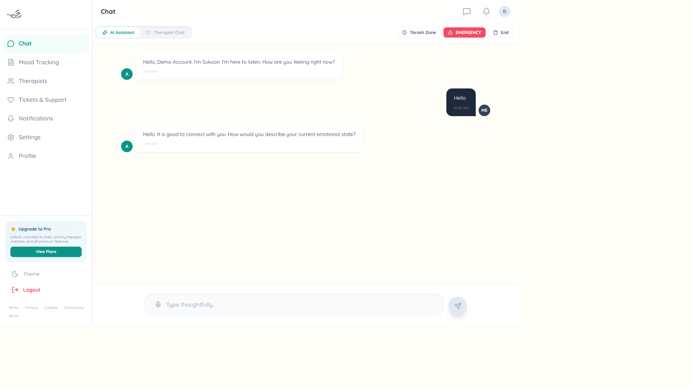

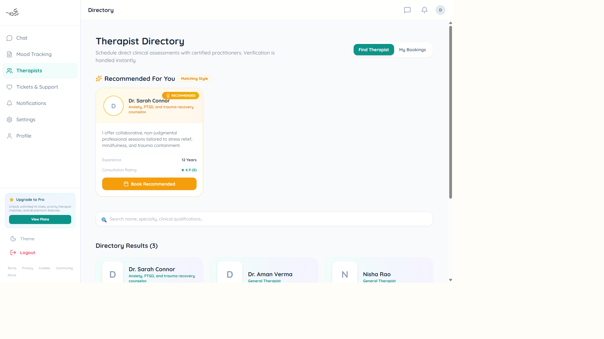

Client booking (`06-client-booking.png`): **PENDING**. Client Demo sends booking to sign-up. A real booking was not created on the production database for this document.

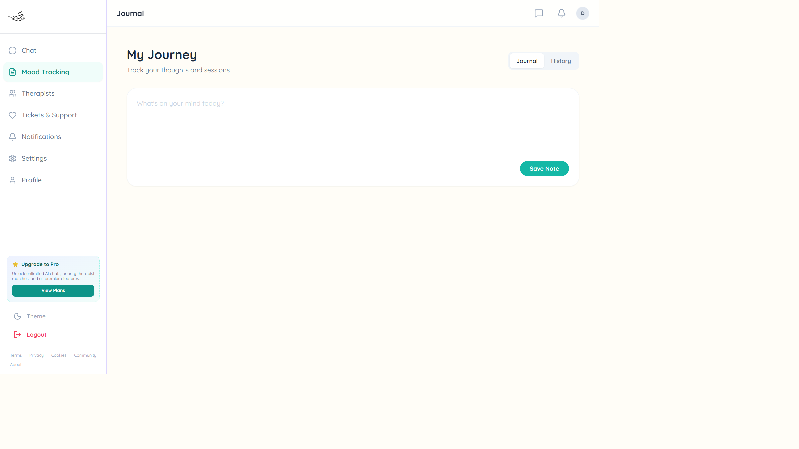

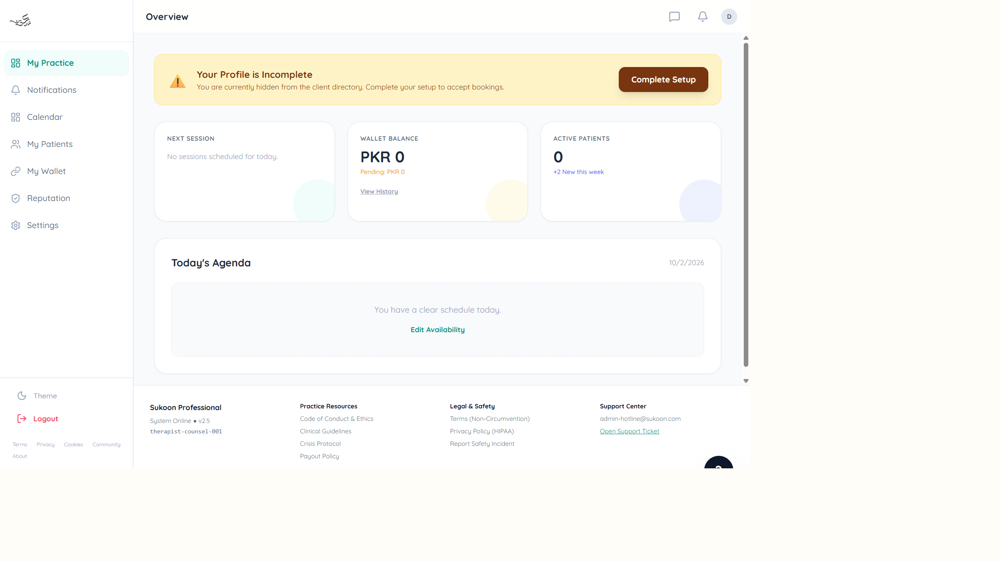

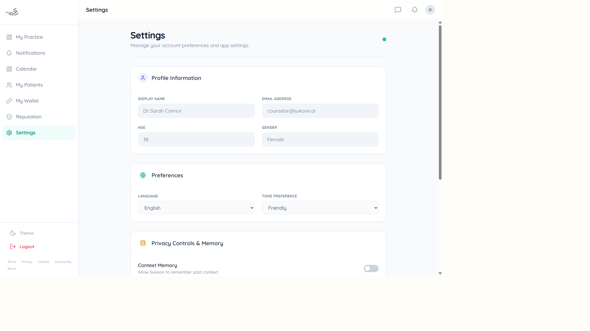

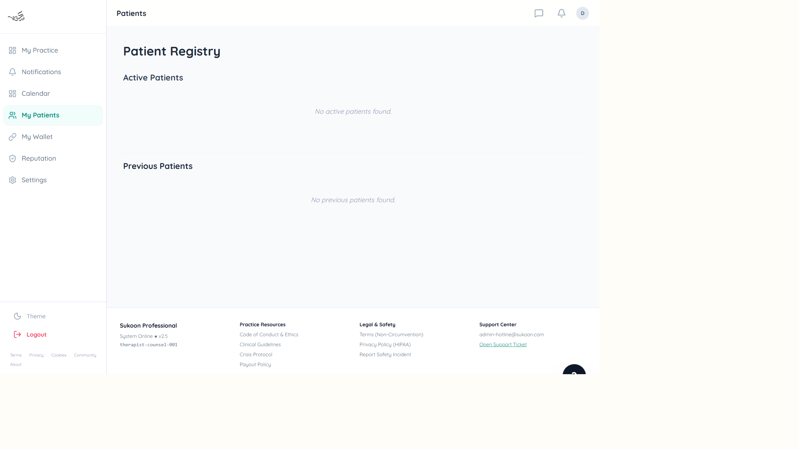

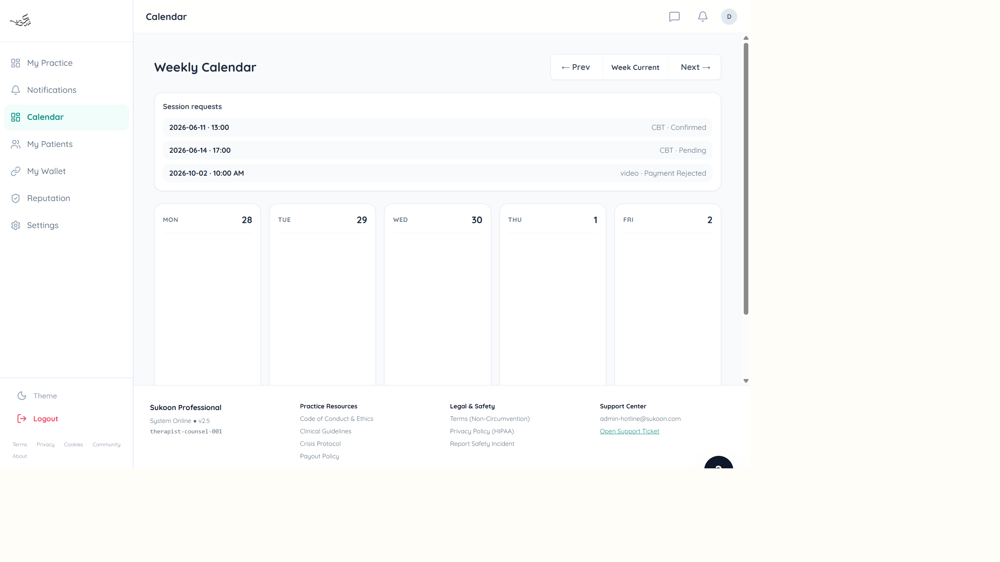

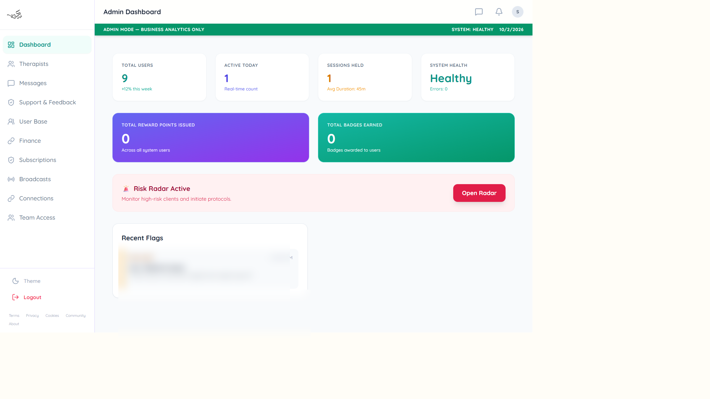

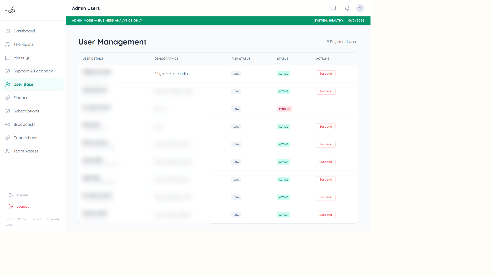

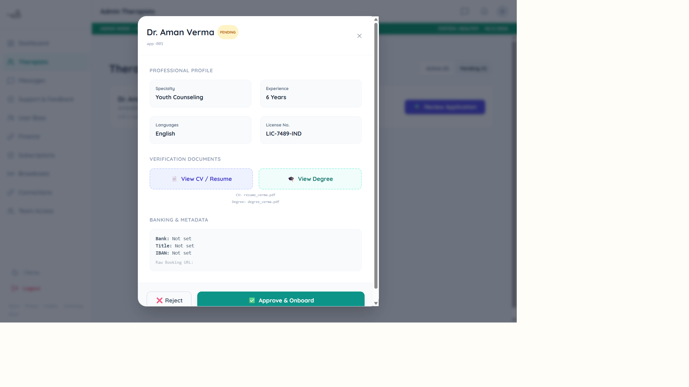

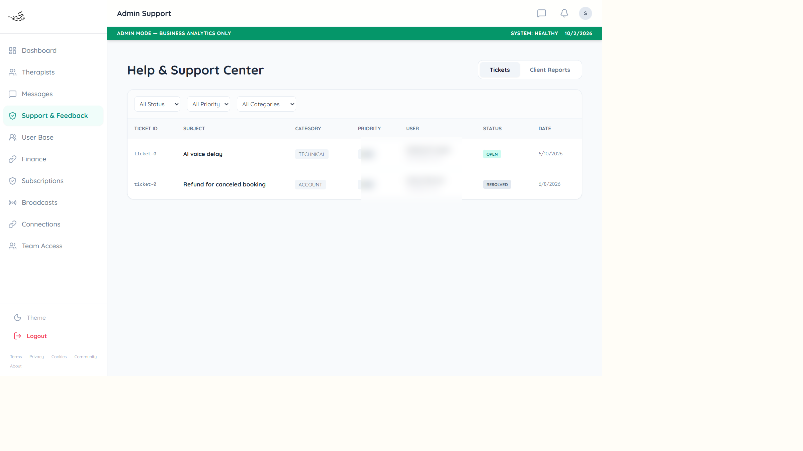

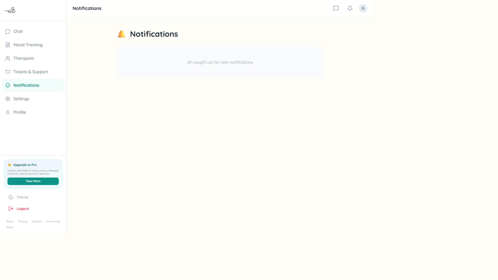

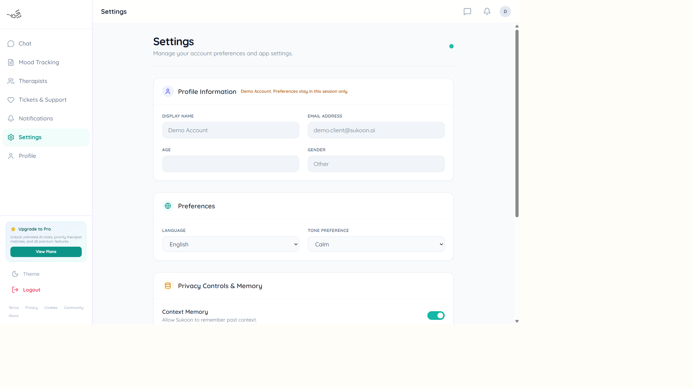


Hackathon proof images, including the ones that are still pending, are listed in [docs/proof/README.md](docs/proof/README.md).

## Testing and QA

Checked on the live site on 2 October 2026:

- Homepage hero and navigation
- Login with Google, email fields, and Client, Therapist, and Admin demo buttons
- Client Demo dashboard, a real AI chat exchange, journal composer, therapist cards, empty notifications, and settings for Demo Account
- Client Demo booking path, which leaves the app for sign-up
- Therapist Demo overview, settings, empty patient registry, and weekly calendar with session requests
- Admin Demo analytics, user table, pending therapist review with Reject and Approve & Onboard, and the support ticket list
- Landing page with a narrow viewport (hamburger navigation and stacked sections)
- Admin viewport guard on a phone-sized width

## 🤝 Let's Connect

Building infrastructure, automating deployments, or solving a cloud problem?
Feel free to connect.

**LinkedIn:** [Syed Moiz](https://www.linkedin.com/in/symoiz/)
**Email:** `symoiz.dev@gmail.com`

## 📜 License

**Proprietary Software — All Rights Reserved**

© 2026 Syed Moiz. All rights reserved.

This project and its source code are the sole property of **Syed Moiz**.

The repository is provided for viewing and reference purposes only. No permission is granted to copy, reproduce, modify, redistribute, commercially use, or create derivative works from this project without prior written permission.

### 🏆 Hackathon Exception

For **hackathon submission and evaluation purposes only**, hackathon organizers, judges, reviewers, and authorized participants are permitted to:

* View and review the source code
* Clone or download the repository for evaluation
* Run and test the project
* Modify configuration or code temporarily when required for testing
* Use the project solely for judging, demonstration, and technical evaluation

This exception **does not grant ownership, commercial rights, redistribution rights, or permission to reuse the project outside the hackathon evaluation process**.

All intellectual property and ownership rights remain with **Syed Moiz**.

**Unauthorized copying, redistribution, commercial use, or reuse outside the permitted hackathon purpose is prohibited.**

The same text is in [LICENSE](LICENSE).
