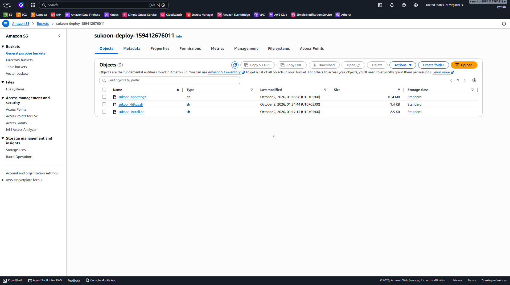
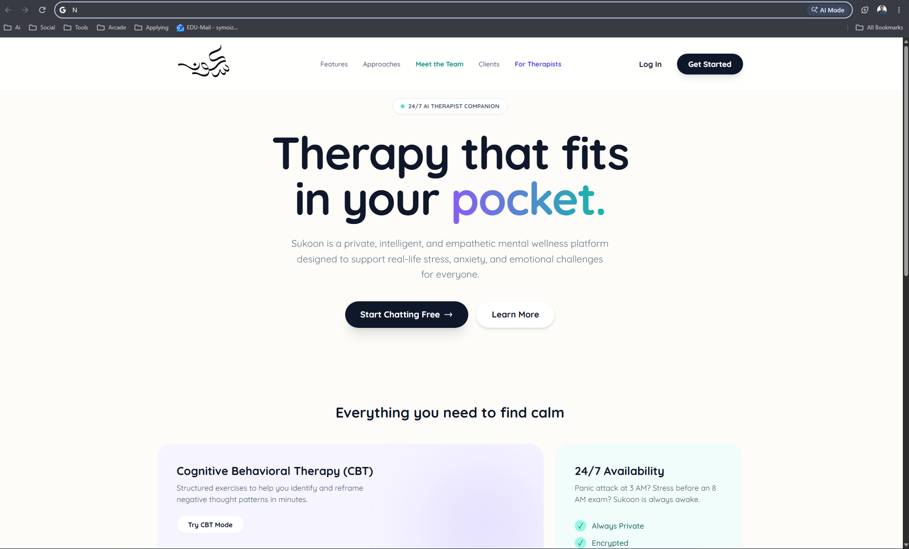
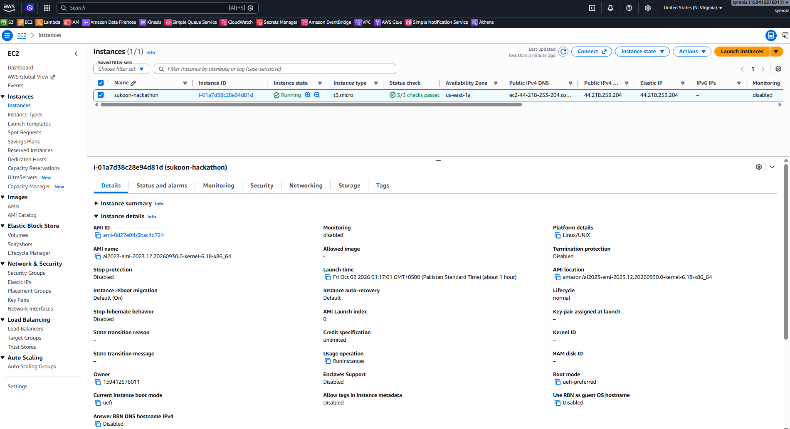
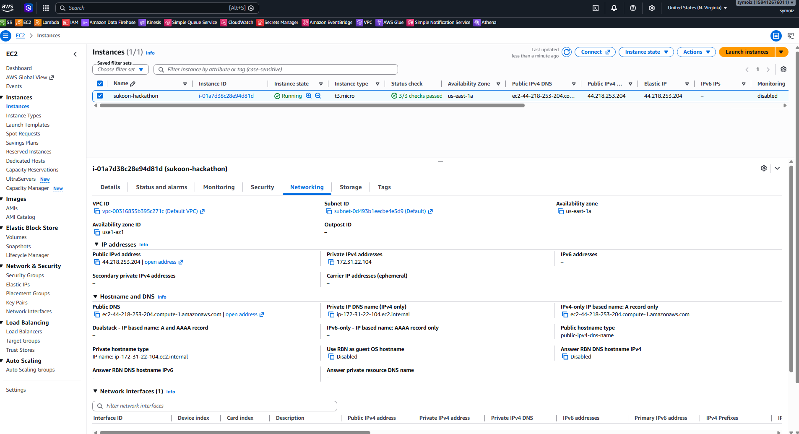

# Sukoon — Hackathon proof

Proof pack for the live Sukoon deployment. Statements below are limited to what was done in this project and checked on 2 October 2026. Missing images are marked **PENDING** and are not linked.

## What this is

| Item | Evidence |
|---|---|
| Application | Sukoon AI Therapist Companion, a mental-wellness web app |
| App category | AI wellness companion (student / community product, not a clinical device) |
| Lane | Community / Startup. This pack is written for that lane. A judge-portal confirmation screenshot was not captured, so portal acceptance is **PENDING** |
| Public URL | [https://www.sukoon.tech](https://www.sukoon.tech) — opened in a browser on 2 October 2026 and returned the live app |
| AWS account in use | `159412676011`, `us-east-1` |
| Coding agent | Cursor in this workspace, with the AWS CLI authenticated as IAM user `claude` on that account |

The reliable URL is `www`. The apex name still has Google A records mixed with the Elastic IP, so `https://sukoon.tech` is not a stable proof URL.

## Coding agent connected to AWS

Cursor in this workspace ran the AWS CLI against the caller’s credentials. That session deployed the app, read instance status, stored the Gemini key in SSM without printing it, and later installed nginx and the certificate. The CLI identity used for the live account was account `159412676011`, IAM user `claude`.

A screenshot of the Cursor window itself was **not** taken. The AWS console shot below is the deploy bucket that the CLI upload created.

## Live application

The browser was pointed at `https://www.sukoon.tech`. Landing, login, Client Demo, Therapist Demo, and Admin Demo were exercised. Application screenshots are in [`docs/screenshots/`](../docs/screenshots/) and are indexed in the root [README](../README.md).

This file is the live homepage. The capture tool does not include the operating-system address bar, so the URL string is not inside the image. The page was loaded from `https://www.sukoon.tech` immediately before the shot.

## AWS deployment proof

Resources that exist for the live site are listed in [aws-services.md](aws-services.md) and [deployment.md](deployment.md). The console view below is the running instance.

## Database proof

PostgreSQL 16 runs in Docker on the EC2 host, bound to `127.0.0.1:5432`. During deploy, demo login succeeded and a journal row was saved and read back. No connection string is included here. The shot below is the instance networking tab (public address `44.218.253.204`). It is not a database client, so a PostgreSQL console screenshot is still **PENDING**.

## How the coding agent helped

On 2 October 2026, in this workspace, Cursor:

- Separated Client Demo from normal Client, Therapist, and Admin persistence, then checked both paths locally
- Pointed the chat model at `gemini-2.5-flash` after `gemini-3.5-flash` returned HTTP 429 on the free tier
- Deployed the existing app with the AWS CLI onto one EC2 instance (first onto account `591292939267` by mistake, then onto `159412676011`)
- Inventoried the mistaken account and did not delete it
- Attached the Elastic IP, then installed nginx and a certificate for `www.sukoon.tech` after DNS was pointed there
- Opened the live site and saved the screenshots in this pack

Work that predates this session is the GitHub history: one commit, `174b09e`, “Initial project upload”, 19 June 2026. That upload is not described as Cursor’s work.

## Documents

- [development-log.md](development-log.md)
- [aws-services.md](aws-services.md)
- [deployment.md](deployment.md)
- [submission-checklist.md](submission-checklist.md)
- [aws-deployment-inventory.md](aws-deployment-inventory.md) — mistaken account `591292939267` only

## Screenshots in this folder

| File | Status |
|---|---|
| `screenshots/19-live-aws-proof.png` | Captured in the browser on the live homepage |
| `screenshots/20.png` | AWS console, deploy bucket `sukoon-deploy-159412676011`. Not a Cursor window |
| `screenshots/21.png` | AWS console, EC2 instance `i-01a7d38c28e94d81d` |
| `screenshots/22.png` | AWS console, EC2 networking tab. Database client screenshot still **PENDING** |
